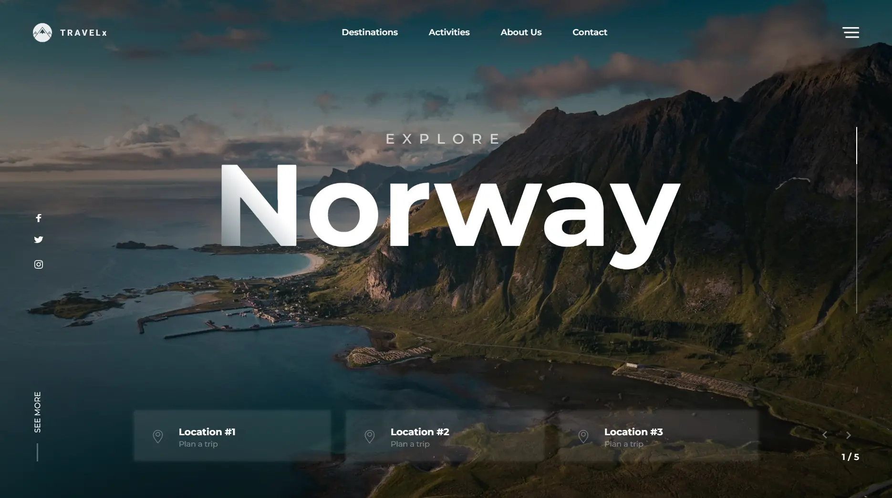

# Travel X

Сайт-путеводитель по странам с реализацией красивого скролла.

## Демо

[https://nikiti7.github.io/TravelX/](https://nikiti7.github.io/TravelX/)

## Главный экран



## Функциональность

- Плавный скролл
- Поддержка адаптивного дизайна
- Интерактивные элементы
- Другие особенности

## Технологии

- HTML5 / CSS3 / JavaScript (ES6+)
- SCSS
- Gulp
- Webpack

## Установка и запуск

Клонировать репозиторий:

```bash
git clone https://github.com/Nikiti7/TravelX.git
```

Перейти в папку проета:

```bash
cd travelX
```

Установить зависимости:

```bash
npm install
```

Сборка проекта:

```bash
gulp
```

Деплой проекта:

```bash
gulp docs
```

## Структура проекта TravelX

```bash
TravelX/
├── docs/        # Деплой проекта
├── galp/        # Настройки galp
├── src/
│   ├── img/    # Изображения, шрифты и др.
│   ├── html/     # Страницы
│   ├── js/     # Основное приложение
│   └── scss   # Стили scss
├── gulp.json
├── package.json
├── .gitignore
├── webpack.config.md
└── README.md
```

## Авторы

Николай
— Frontend Developer

## Лицензия

Проект распространяется под лицензией MIT
